# 📊 Dashboards com Power BI | DSA

Este repositório apresenta **dashboards interativos** desenvolvidos com o **Microsoft Power BI** durante o curso Microsoft Power BI para Business Intelligence e Ciência de Dados da [Data Science Academy](https://www.datascienceacademy.com.br/).

Os projetos utilizam dados simulados, com foco em vendas, marketing e performance comercial, aplicando conceitos de BI para gerar insights e apoiar decisões estratégicas.

## 🎯 Objetivos

Reunir em um único repositório os projetos práticos desenvolvidos com Power BI, demonstrando habilidades em Business Intelligence por meio de dashboards interativos e orientados a negócios. Os projetos destacam a aplicação de:
- Conceitos de BI e visualização de dados
- KPIs relevantes e gráficos interativos
- Filtros dinâmicos e segmentações por categorias
- Recursos avançados do Power BI (DAX, Power Query)
- Geração de insights acionáveis para apoio à decisão

## 📁 Estrutura do Repositório

- `arquivos-pbix/`: arquivos .pbix dos dashboards
- `datasets/`: bases de dados utilizadas
- `imagens/`: imagens dos dashboards prontos
- `insights/`: anotações com análises e interpretações

## 📌 Dashboards

| Painel                          | Descrição                                                                 | Imagem                            |
|--------------------------------|---------------------------------------------------------------------------|-----------------------------------|
| **Vendas Globais**             | Análise de KPIs, faturamento, regiões e categorias de produto             | 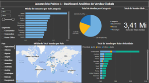                |
| **Vendas, Custo, KPI**         | Visualizações financeiras com cascata, treemap e análise de margem        | 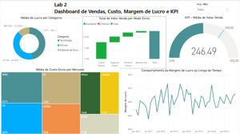                |
| **MiniProjeto 1 – Análise de Campanhas de Marketing com Power BI** | Visão integrada de clientes, comportamento de compra, performance de campanhas e padrões por país | 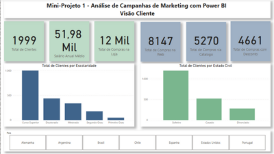 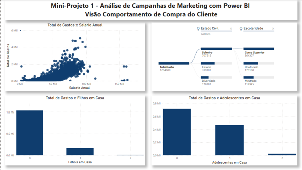 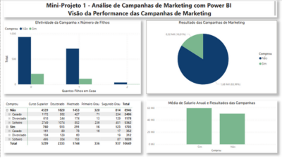 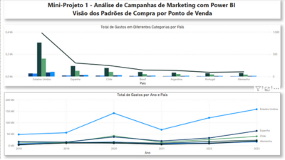 |
| **MiniProjeto 2 – Dashboard Comercial de Vendas** | Performance comercial com narrativa inteligente, principais influenciadores e gráfico de faixas | 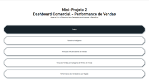  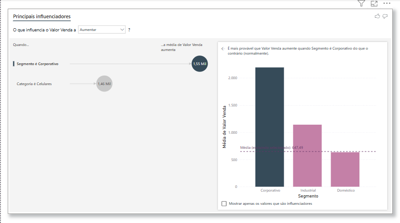 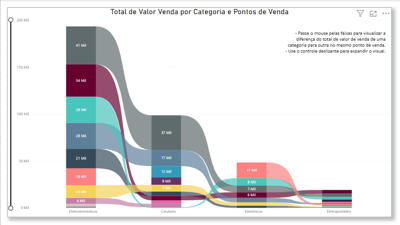 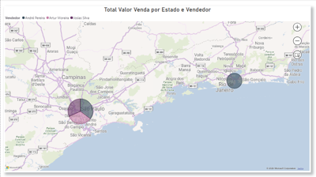 |
| **MiniProjeto 3 – Dashboard de Recursos Humanos** | Análise do quadro de funcionários com KPIs de gênero, tempo de experiência, disponibilidade e envolvimento |  |
| **MiniProjeto 4 – Dashboard de Logística e Entregas** | Visão dos processos de entrega com KPIs por canal, equipe, cidade, status e vendedores | 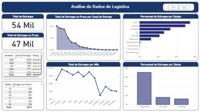 |
| **MiniProjeto 5 – Dashboard Financeiro** | Monitoramento de receitas, despesas, margem de lucro e hierarquia por componente e ano | 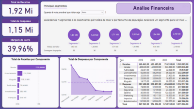 |

## 📘 Conteúdo Detalhado

### 🔹 Lab 1 – Dashboard Analítico de Vendas Globais

> Análise global de vendas com foco em categorias, países e descontos. Inclui mapa de vendas e visualizações orientadas por prioridade de entrega.

**Perguntas respondidas:**
- Qual o valor total vendido?
- Quantas vendas por categoria de produto?
- Quantas vendas por país e prioridade?
- Qual a média de desconto por subcategoria?
- Quais países com maior média de venda? (com mapa)

[📥 Lab1 - Baixar arquivo .pbix](./arquivos-pbix/Lab1-Dashboard-Vendas.pbix)

---

### 🔹 Lab 2 – Vendas, Custo, Lucro e KPIs

> Estudo financeiro com visualizações de desempenho e lucratividade, incluindo gráficos de cascata, treemap e KPIs.

**Perguntas respondidas:**
- Valor de venda por modo de envio?
- Custo médio por mercado?
- Média de vendas x meta (abril/2014)?
- Lucro médio por categoria?
- Margem de lucro ao longo do tempo?

[📥 Lab2 - Baixar arquivo .pbix](./arquivos-pbix/Lab2-Dashboard-KPI.pbix)

---

### 🔹 MiniProjeto 1 – Análise de Campanhas de Marketing

> Exploração completa de campanhas de marketing, comportamento do cliente e padrões de compra, dividida em 4 visões:

- Visão do Cliente  
- Visão do Comportamento de Compra  
- Visão da Performance das Campanhas  
- Visão de Padrões de Compra no Ponto de Venda  

[📥 MiniProjeto1 - Baixar arquivo .pbix](./arquivos-pbix/MiniProjeto1-Marketing.pbix)

---

### 🔹 MiniProjeto 2 – Dashboard Comercial de Vendas

> Análise de performance comercial com recursos avançados como narrativa inteligente, principais influenciadores, gráfico de faixas e menu interativo.

[📥 MiniProjeto2 - Baixar arquivo .pbix](./arquivos-pbix/MiniProjeto2-Comercial.pbix)

---

### 🔹 MiniProjeto 3 – Dashboard de Recursos Humanos

> Análise de indicadores de RH com foco em gênero, tempo de experiência, envolvimento, promoção e disponibilidade para hora extra.

**Perguntas respondidas:**
- Qual o total de funcionários atualmente na empresa?
- Qual o tempo médio de experiência dos funcionários?
- Qual o total e percentual por gênero?
- Qual a média salarial mensal?
- Quantos funcionários por função?
- Percentual disponível para hora extra?
- Como está o nível de envolvimento?
- Quantos devem receber promoção?

[📥 MiniProjeto3 - Baixar arquivo .pbix](./arquivos-pbix/MiniProjeto3-RH.pbix)

---

### 🔹 MiniProjeto 4 – Dashboard de Logística e Entregas

> Visão analítica sobre o desempenho logístico, com foco em pontualidade, cidades com maior atraso e canais de entrega.

**Indicadores e KPIs:**
- Total de entregas no prazo por canal
- Percentual de entregas antecipadas por equipe
- Total de entregas por mês
- Top 5 vendedores por volume de entrega
- Entregas com atraso por cidade
- Percentual por status de entrega

[📥 MiniProjeto4 - Baixar arquivo .pbix](./arquivos-pbix/MiniProjeto4-Logistica.pbix)

---

### 🔹 MiniProjeto 5 – Dashboard Financeiro

> Monitoramento das receitas e despesas da empresa, com análise de margem de lucro e hierarquia por componente e ano.

**Indicadores de negócio:**
- Total de Receitas
- Total de Despesas
- Margem de Lucro
- Receitas por componente
- Despesas por componente (comparação com a média)
- Análise por tipo e ano (com hierarquia)

[📥 MiniProjeto5 - Baixar arquivo .pbix](./arquivos-pbix/MiniProjeto5-Financeiro.pbix)

---

### 📸 Exemplos Visuais

Clique para ampliar as imagens dos dashboards desenvolvidos:

## 📂 Datasets

As bases de dados utilizadas nos projetos estão na pasta [📁 datasets](./datasets/) para fins educacionais.

## 📚 Análises e Insights

Cada projeto conta com um arquivo em [📁 insights](./insights/) contendo os aprendizados e interpretações extraídas a partir das visualizações.

## 🧰 Tecnologias Utilizadas

- Microsoft Power BI Desktop
- DAX (Data Analysis Expressions)
- Power Query
- Visualizações nativas e customizadas

## 📚 Curso

Curso: [Microsoft Power BI para Business Intelligence e Ciência de Dados](https://www.datascienceacademy.com.br/course/microsoft-power-bi-para-business-intelligence-e-ciencia-de-dados)  
Instituição: Data Science Academy  
Carga horária: +60 horas

## 🤝 Contribuição

Este repositório é voltado para fins educacionais e portfólio pessoal. Feedbacks são bem-vindos!

## 📄 Licença

Este projeto é de uso educacional e não possui fins comerciais. Dados e análises são simulados ou adaptados. Consulte os termos de uso da [Data Science Academy](https://www.datascienceacademy.com.br/) para mais informações.

---

👩‍💻 Desenvolvido por: **Lidiane Souza**  
🔗 [Linkedin](https://www.linkedin.com/in/lidiane-souza88)
