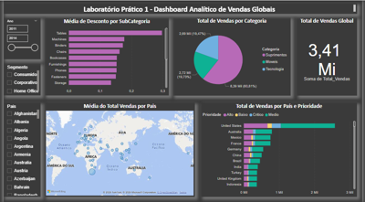
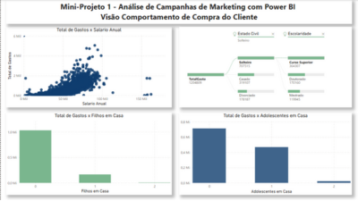

# 📊 Dashboards com Power BI | DSA

Este repositório apresenta **dashboards interativos** desenvolvidos com o **Microsoft Power BI** durante o curso Microsoft Power BI para Business Intelligence e Ciência de Dados da [Data Science Academy](https://www.datascienceacademy.com.br/).

Os projetos utilizam dados reais e simulados, com foco em vendas, marketing e performance comercial, aplicando conceitos de BI para gerar insights e apoiar decisões estratégicas.

## 🎯 Objetivos

Reunir em um único repositório os projetos práticos desenvolvidos com Power BI, demonstrando habilidades em Business Intelligence por meio de dashboards interativos e orientados a negócios. Os projetos destacam a aplicação de:
- Conceitos de BI e visualização de dados
- KPIs relevantes e gráficos interativos
- Filtros dinâmicos e segmentações por categorias
- Recursos avançados do Power BI (DAX, Power Query)
- Geração de insights acionáveis para apoio à decisão

## 📁 Estrutura do Repositório

- `arquivos-pbix/`: arquivos .pbix dos dashboards
- `datasets/`: bases de dados utilizadas
- `imagens/`: imagens dos dashboards prontos
- `insights/`: anotações com análises e interpretações

## 📌 Dashboards

| Painel                          | Descrição                                                                 | Imagem                            |
|--------------------------------|---------------------------------------------------------------------------|-----------------------------------|
| **Vendas Globais**             | Análise de KPIs, faturamento, regiões e categorias de produto             |                 |
| **Vendas, Custo, KPI**         | Visualizações financeiras com cascata, treemap e análise de margem        |                 |
| **Mini-Projeto 1 – Análise de Campanhas de Marketing com Power BI** | Visão integrada de clientes, comportamento de compra, performance de campanhas e padrões por país |     |
| **Mini-Projeto 2 – Dashboard Comercial de Vendas** | Performance comercial com narrativa inteligente, principais influenciadores e gráfico de faixas |     |

## 📘 Conteúdo Detalhado

### 🔹 Lab 1 – Dashboard Analítico de Vendas Globais

> Análise global de vendas com foco em categorias, países e descontos. Inclui mapa de vendas e visualizações orientadas por prioridade de entrega.

**Perguntas respondidas:**
- Qual o valor total vendido?
- Quantas vendas por categoria de produto?
- Quantas vendas por país e prioridade?
- Qual a média de desconto por subcategoria?
- Quais países com maior média de venda? (com mapa)

[📥 Baixar arquivo .pbix](./arquivos-pbix/Lab1-Dashboard-Vendas.pbix)

---

### 🔹 Lab 2 – Vendas, Custo, Lucro e KPIs

> Estudo financeiro com visualizações de desempenho e lucratividade, incluindo gráficos de cascata, treemap e KPIs.

**Perguntas respondidas:**
- Valor de venda por modo de envio?
- Custo médio por mercado?
- Média de vendas x meta (abril/2014)?
- Lucro médio por categoria?
- Margem de lucro ao longo do tempo?

📎 Arquivo: `lab2-vendas-custos-kpi.pbix`

---

### 🔹 Mini-Projeto 1 – Análise de Campanhas de Marketing

> Exploração completa de campanhas de marketing, comportamento do cliente e padrões de compra, dividida em 4 visões:

- Visão do Cliente  
- Visão do Comportamento de Compra  
- Visão da Performance das Campanhas  
- Visão de Padrões de Compra no Ponto de Venda  

📎 Arquivo: `mini-projeto1-campanhas-marketing.pbix`

---

### 🔹 Mini-Projeto 2 – Dashboard Comercial de Vendas

> Análise de performance comercial com recursos avançados como narrativa inteligente, principais influenciadores, gráfico de faixas e menu interativo.

📎 Arquivo: `mini-projeto2-performance-vendas.pbix`

---

### 📸 Exemplos Visuais

Clique para ampliar as imagens dos dashboards desenvolvidos:

## 📂 Datasets

As bases de dados utilizadas nos projetos estão na pasta `datasets/` para fins educacionais.

## 📚 Análises e Insights

Cada projeto conta com um arquivo em `insights/` contendo os aprendizados e interpretações extraídas a partir das visualizações.

## 🧰 Tecnologias Utilizadas

- Microsoft Power BI Desktop
- DAX (Data Analysis Expressions)
- Power Query
- Visualizações nativas e customizadas

## 📚 Curso

Curso: [Microsoft Power BI para Business Intelligence e Ciência de Dados](https://www.datascienceacademy.com.br/course/microsoft-power-bi-para-business-intelligence-e-ciencia-de-dados)  
Instituição: Data Science Academy  
Carga horária: +60 horas

## 🤝 Contribuição

Este repositório é voltado para fins educacionais e portfólio pessoal. Feedbacks são bem-vindos!

## 📄 Licença

Este projeto é de uso educacional e não possui fins comerciais. Dados e análises são simulados ou adaptados. Consulte os termos de uso da [Data Science Academy](https://www.datascienceacademy.com.br/) para mais informações.

---

👩‍💻 Desenvolvido por: **Lidiane Souza**  
🔗 [www.linkedin.com/in/lidiane-souza88](https://www.linkedin.com/in/lidiane-souza88)
