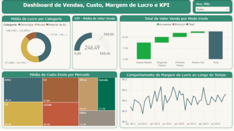

# 📊 Laboratório 2 – Vendas, Custos, Lucro e KPIs

Neste projeto, foram analisadas métricas financeiras e operacionais relacionadas ao desempenho de vendas e lucratividade. O objetivo foi gerar insights a partir de gráficos como cascata, treemap e análise temporal de lucro.

---

## 🔍 Perguntas respondidas

- Valor de venda por modo de envio?
- Custo médio por mercado?
- Média de vendas x meta (abril/2014)?
- Lucro médio por categoria?
- Margem de lucro ao longo do tempo?

---

## 📈 Principais visualizações

- Gráfico de cascata (faturamento, custo, lucro)
- Treemap de lucro por categoria
- Linha de tendência da margem de lucro ao longo do tempo
- Tabela com KPI de metas versus realizado
- Gráfico por modo de envio

🖼️ 

---

## 🧩 Insights Estratégicos

Este painel evidenciou que a análise integrada de indicadores financeiros, segmentados por categoria e modo de envio, é fundamental para identificar oportunidades concretas de redução de custos e maximização de margens. As visualizações revelam padrões operacionais que permitem a formulação de estratégias logísticas mais eficientes e ajustes de precificação alinhados ao comportamento do mercado, potencializando a competitividade e a rentabilidade do negócio.

---

## 📁 Arquivo PBIX

🗂️ `arquivos-pbix/Lab2-Dashboard-KPI.pbix`

---

## 📄 Base de Dados

📂 `datasets/lab2_kpi_data`

---
