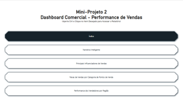

# 📈 Mini-Projeto 2 - Dashboard Comercial: Performance de Vendas

Este projeto tem como objetivo analisar a performance de vendas por meio de cinco dashboards interativos que exploram influenciadores, segmentos, categorias e desempenho de vendedores por região.

## 🔎 Visão Geral

O relatório é composto pelos seguintes painéis:

| Dashboard | Descrição | Miniatura |
|----------|-----------|-----------|
| Índice Navegável | Tela inicial com botões de navegação para os dashboards posteriores |  |
| Narrativa Inteligente, Total por Segmento, Fabricante e Categoria | Análises visuais do total de vendas por diferentes dimensões. |  |
| Principais Influenciadores de Vendas | Principais variáveis que influenciam o resultado de vendas. |  |
| Categoria vs Pontos de Venda | Gráfico de Sankey destacando fluxos entre categorias e locais de venda. |  |
| Performance dos Vendedores por Região | Análise comparativa da performance individual por região. |  |

---

## 🧠 Insights Relevantes

### 🗣️ 1. Narrativa Inteligente
- O segmento **Doméstico** lidera com 71,47% do total de vendas.
- **Brastemp** foi o fabricante com maior volume de vendas.
- A narrativa textual permite rápida identificação dos principais pontos de destaque sem interação com gráficos.

### 🧾 2. Total por Segmento, Fabricante e Categoria
- Segmentos Corporativo e Industrial têm menor participação.
- Os **Eletrodomésticos** dominam nas categorias.
- Variações significativas entre fabricantes evidenciam concentração de receita.

### 📈 3. Principais Influenciadores de Vendas
- O segmento **Corporativo** está fortemente relacionado a vendas de maior valor.
- A categoria **Celulares** aparece como um dos fatores que mais influenciam o ticket médio.
- O modelo identifica padrões relevantes que podem ser explorados em estratégias comerciais.

### 🔄 4. Categoria vs Pontos de Venda (Sankey)
- O gráfico destaca os principais fluxos de valor entre categorias e canais.
- **Eletrodomésticos** apresentam dispersão equilibrada nos pontos de venda.
- Permite identificar gargalos ou oportunidades em canais específicos.

### 📍 5. Performance dos Vendedores por Região
- Estados com maior volume de vendas são SP, RJ e MG.
- Vendedores com destaque concentram resultados nas capitais.
- Útil para planejamento de metas e realocação de força de vendas.

---

## 📁 Arquivo PBIX

🗂️ `arquivos-pbix/MiniProjeto2_Comercial.pbix`

---

## 📄 Base de Dados

📂 `datasets/miniprojeto2_comercial_data`
