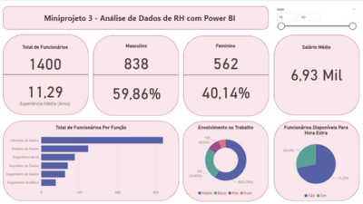

# 👥 MiniProjeto 3 – Dashboard de Recursos Humanos

Este projeto apresenta uma análise exploratória de dados de Recursos Humanos, com a criação de um dashboard interativo no Power BI para apoiar decisões estratégicas da área. O objetivo é responder perguntas-chave sobre a composição dos colaboradores, média salarial, disponibilidade para hora extra e potenciais promoções.

---

## 🔍 Perguntas respondidas

1. Qual o total de funcionários atualmente na empresa?
2. Qual o tempo médio de experiência dos funcionários (em anos)?
3. Qual o total e percentual de funcionários do gênero masculino e feminino?
4. Qual a média salarial mensal?
5. Qual o total de funcionários por função?
6. Qual o percentual de funcionários disponíveis para fazer hora extra?
7. Qual o nível de envolvimento dos funcionários no trabalho considerando 4 categorias: Ruim, Baixo, Médio e Alto?
8. (Extra) Qual o total e percentual de funcionários que devem receber promoção, considerando a coluna “Anos Data Science Academy”?

---

## 📈 Principais visualizações

- KPI com total de funcionários
- KPI com tempo médio de experiência
- Gráficos de pizza com distribuição por gênero e por hora extra
- Gráfico de barras com total de funcionários por função
- Gráfico de colunas com nível de envolvimento
- Média salarial mensal por departamento

🖼️

---

## 🧩 Insights Estratégicos

A análise permitiu entender melhor a estrutura atual da equipe, destacando a distribuição de gênero, tempo de casa, envolvimento com o trabalho e funções com maior representatividade. O cálculo de funcionários elegíveis para promoção também permite direcionar ações estratégicas de reconhecimento e desenvolvimento.

---

## 📁 Arquivo PBIX

🗂️ `arquivos-pbix/Miniprojeto3-Dashboard-RH.pbix`

---

## 📄 Base de Dados

📂 `datasets/rh_funcionarios_dsa.csv`  

---
