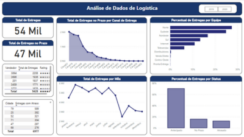

# 🚚 Mini-Projeto 4 – Dashboard de Logística e Entregas

Este projeto tem como objetivo a criação de um dashboard interativo no Power BI, permitindo à empresa de logística analisar a eficiência de seus processos de entrega. O painel corrige problemas apresentados em uma versão anterior e fornece uma visão clara dos principais KPIs logísticos.

---

## 🔍 Perguntas respondidas

1. Qual o total de entregas no prazo por canal de entrega?
2. Qual o percentual de entregas antecipadas por equipe de entrega?
3. Qual o total de entregas por mês?
4. Quais os totais de entregas realizadas pelos Top 5 vendedores?
5. Qual o total de entregas com atraso por cidade?
6. Qual o percentual de entregas por status de entrega?

---

## 📈 Principais visualizações

- Gráfico de colunas com entregas no prazo por canal
- Gráfico de barras horizontais com entregas antecipadas por equipe
- Gráfico de linhas com entregas por mês
- Gráfico de colunas com entregas por Top 5 vendedores
- Mapa ou gráfico de barras com entregas em atraso por cidade
- Gráfico de pizza com percentual por status de entrega
- KPIs com totais e percentuais destacados

🖼️

---

## 🧩 Insights Estratégicos

O painel permite uma análise precisa da performance de entregas, destacando possíveis gargalos logísticos, desempenho por equipe, canais mais eficientes e cidades com maior índice de atraso. As informações suportam decisões operacionais e melhorias nos processos de entrega.

---

## 📁 Arquivo PBIX

🗂️ `arquivos-pbix/Miniprojeto4-Dashboard-Logistica.pbix`

---

## 📄 Base de Dados

📂 `datasets/logistica_entregas_dsa.csv`  

---
