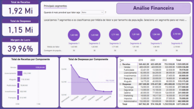

# 💰 Mini-Projeto 5 – Dashboard Financeiro com Power BI

Este projeto tem como objetivo desenvolver um dashboard financeiro interativo para análise de **receitas, despesas e margem de lucro**, permitindo que a empresa acompanhe seu desempenho econômico por componente e período, e identifique oportunidades de melhoria.

---

## 🔍 Perguntas respondidas

1. Qual o total de receitas?
2. Qual o total de despesas?
3. Qual a margem de lucro?
4. Qual o total de receitas por componente?
5. Qual o total de despesas por componente, comparado à média?
6. Como as receitas e despesas estão distribuídas por componente e por ano (com hierarquia Tipo/Componente)?
7. Quais segmentos apresentam maiores e menores valores de receita e despesa?

---

## 📈 Principais visualizações

- KPIs de Receita Total, Despesa Total e Margem de Lucro
- Gráfico de barras com receita por componente
- Gráfico de colunas com despesas por componente e linha da média
- Gráfico combinado com hierarquia Tipo → Componente → Ano
- Segmentações de dados por período e categoria
- Destaque visual dos segmentos com maior e menor desempenho

🖼️

---

## 🧩 Insights Estratégicos

O dashboard possibilita uma **visão integrada das finanças da empresa**, permitindo identificar os componentes que mais impactam nas receitas e nas despesas. A hierarquia por ano facilita o acompanhamento temporal e a análise de tendências, apoiando decisões estratégicas e de planejamento orçamentário.

---

## 📁 Arquivo PBIX

🗂️ `arquivos-pbix/Miniprojeto5-Dashboard-Financeiro.pbix`

---

## 📄 Base de Dados

📂 `datasets/financeiro_dsa.csv`  

---
